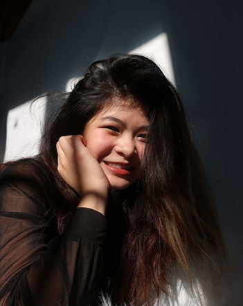

# openframeworks
This is Creative Coding: OpenFrameworks' repository, created for assignment 2.  
This class is taught by Prof. Michael Wolf, Spring 2020. 
## Bio

<!--- testing comment --->
Hi, I'm Sky.  
I'm an Illustrator and a Creative Technologist.  
I like programming as much as crafting! My recent projects emphasize on audience collaborations and projection mapping.  
Find out more about me at: https://skyta.me/.
<!--- Website to be updated more on in the near future for latest works. --->
